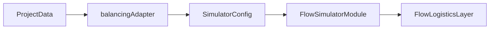

# Guía de Despliegue del Simulador de Flujo

Guía técnica para desplegar y mantener el simulador de flujo integrado.

## Requisitos

- Node.js 18+
- npm 9+
- Tauri CLI (para builds de escritorio)

## Instalación

```bash
# Clonar e instalar
npm install

# Desarrollo
npm run dev

# Build producción
npm run build
```

## Estructura del Módulo

```
modules/flow-simulator/
├── FlowSimulatorModule.tsx   # Componente principal React
├── flowLogistics.ts          # Capa de logística (inventario, Milk Run)
├── flowTypes.ts              # Definiciones de tipos
├── balancingAdapter.ts       # Parsers para integración [NEW]
├── desSimulationEngine.ts    # Motor DES optimizado
├── apmExport.ts              # Exportación de reportes APM
└── flow-simulator.css        # Estilos
```

## Integración con Balanceo

### Flujo de Datos



### Funciones de Parser

| Función | Entrada | Salida |
|---------|---------|--------|
| `parseShiftsToCalendar` | `Shift[]` | `ShiftCalendar` |
| `parseDemandConfig` | `ProjectData` | `DemandConfig` |
| `parseStationsFromBalancing` | `ProjectData` | `SimulatorStation[]` |
| `syncDeltaChanges` | `SimulatorConfig, ProjectData` | `Partial<SimulatorConfig>` |

## Sincronización

### Detección de Cambios

El hash de balanceo incluye:
- `tasks[].id, standardTime, averageTime`
- `assignments[]`
- `stationConfigs[].oeeTarget, cycleTimeOverride`
- `shifts[]`
- `meta.dailyDemand, activeShifts`

### Comportamiento

| Estado Sim | Acción |
|------------|--------|
| `idle` / `paused` | Auto-sync |
| `running` | Bandera `syncPending = true` |

## Tests

```bash
# Todos los tests
npm test

# Solo integración balanceo
npm test -- balancing_integration

# Con cobertura
npm test -- --coverage
```

### Suite de Tests de Integración

- `parseShiftsToCalendar` (4 tests)
- `parseDemandConfig` (3 tests)
- `parseStationsFromBalancing` (4 tests)
- `computeBalancingHash` (4 tests)
- `syncDeltaChanges` (3 tests)
- `parseProjectToSimulator` (2 tests)

## Actualización

### Cuando Cambia el Schema de ProjectData

1. Actualizar tipos en `types.ts`
2. Actualizar mapeos en `balancingAdapter.ts`
3. Agregar tests para nuevos campos
4. Actualizar `computeBalancingHash` si afecta sincronización

### Versionado

El simulador sigue semver con el proyecto principal:
- **MAJOR**: Cambios incompatibles en API
- **MINOR**: Nuevas funcionalidades
- **PATCH**: Correcciones de bugs

## Solución de Problemas

### Error: "Cannot find module './balancingAdapter'"

**Causa**: Build incompleto.

**Solución**: `npm run build` y verificar compilación TS.

### Tests Fallan Después de Cambio en types.ts

**Causa**: Mock de `createTestProjectData()` desactualizado.

**Solución**: Actualizar el helper en `balancing_integration.test.ts`.

### Sincronización No Preserva Estado

Verificar que la función de sync use spread para preservar propiedades:
```typescript
return {
    ...station,
    cycleTime: newStation.cycleTimeSeconds,
    // Propiedades logísticas se heredan del ...station
};
```

## Métricas de Rendimiento

| Escenario | Tiempo Esperado |
|-----------|-----------------|
| Parse 100 estaciones | < 50ms |
| Sync delta | < 10ms |
| Hash computation | < 5ms |

## Contacto

Para issues técnicos, crear ticket en el repositorio con tag `flow-simulator`.
