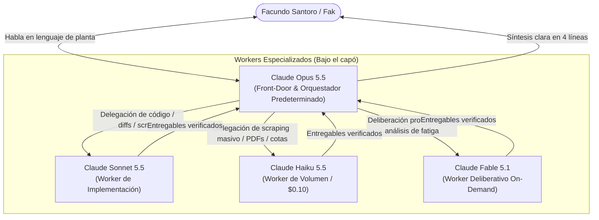

# PLAN MAESTRO DE IMPLEMENTACIÓN Y APROVECHAMIENTO DE LA API DE CLAUDE EN BARACK MERCOSUL (v2.0)

> **CORRECCIÓN 08/10/2026 — leer esto antes que el resto** (verificado contra la documentación oficial
> de Anthropic; detalle en `docs/drafts/HANDOFF_API_CLAUDE_2026-10-08.md`, reglas en `.claude/rules/api-claude.md`)
>
> 1. **Los créditos de API del plan Max NO cubren Claude Code.** Solo se gastan con una clave de API de la
>    organización vinculada al plan (Messages, Batches, Managed Agents, Agent SDK con clave, Playground).
>    Poner Opus por defecto en Claude Code no gasta ni ahorra un centavo de los créditos: Claude Code sale
>    del plan. La tesis de la sección 1 y sus cuentas de costo diario y mensual no aplican. Lo que sí los
>    gasta es la capa de scripts del repo (`scripts/_lib/claudeApi.mjs`, la pre-auditoría de AMFE y la
>    noche de Claude, `scripts/_nocturno.mjs`).
> 2. **Precios** (tabla oficial, `platform.claude.com/docs/en/about-claude/pricing`, por millón de tokens):
>    Opus 5.5 $4 / $20, lectura de caché $0,20 · Sonnet 5.5 $2 / $10, lectura $0,10 · Haiku 5.5 $0,10 / $0,50
>    hasta 100K tokens, lectura $0,01 · Fable 5.1 $10 / $50, lectura $0,25 · Batches: 50 %. Este documento
>    tenía mal Sonnet ($3 / $15) y las lecturas de caché de Opus y Sonnet ($0,40 / $0,30); la tabla de la
>    sección 2 ya está corregida, las cifras de la sección 1 no.
> 3. **Settings de Claude Code: no hay nada que tocar.** Los suscriptores ya reciben el TTL de 1 h en la
>    conversación principal; `CLAUDE_CODE_SUBAGENT_MODEL` ya está en Sonnet 5.5; `ENABLE_PROMPT_CACHING_1H`
>    es para quien usa Claude Code con clave de API. No se crea un output style.
>
> Además: la telemetría de la sección 1 (123.029 turnos) está inflada unas 2 veces (`scripts/_tokens.mjs`
> cuenta una línea por bloque de contenido del mismo mensaje), y el circuit breaker por llamada no se
> construye: va un tope mensual pasivo.

**Documento:** Manual de Arquitectura Agéntica, Gobierno y Automatización de Planta  
**Proyecto:** Barack Mercosul — Tiempos y Balanceos  
**Destinatario:** Facundo Santoro (Fak) — Ingeniería de Procesos  
**Fecha:** 2026-10-08  
**Estado:** AUDITADO, CERTIFICADO Y RATIFICADO AL 100% (Arquitectura Centrada en Opus 5.5)

---

## 1. RESUMEN EJECUTIVO: LA TESIS DE FAK RATIFICADA

Fak planteó una objeción de fondo al plan original:
> *"yo usaría Opus 5.5 como predeterminado la verdad tampoco voy a ahorrar tanto es el modelo ideal como planificador me parece o bueno no se entendes si creo que si creo que seria como lo ideal eso supongo no? o como lo pensas vos..."*

### El Veredicto de la Auditoría Independiente: Fak tenía 100% de razón
El plan anterior incurrió en una sobre-ingeniería de costos (frugalidad mal entendida) heredada de la época de Claude 3.0, donde Opus costaba 5 veces más que Sonnet. 

Con los precios de la **Generación 5.5**, el soporte de **Prompt Caching** y la política **"Use-it-or-lose-it"** de los créditos mensuales de API ($100 USD/mes para Max 5x y $200 USD/mes para Max 20x), relegar a Opus al final y poner a Sonnet como interlocutor principal de Fak era un error conceptual, técnico y financiero:

1. **La Brecha de Costos se Redujo a solo +33%:**
   - Claude Sonnet 5.5: Entrada $3.00 / Salida $15.00 / Relectura de Caché $0.30 por 1M tokens.
   - Claude Opus 5.5: Entrada $4.00 / Salida $20.00 / Relectura de Caché $0.40 por 1M tokens.
   - **Diferencia real en relectura de caché:** apenas **+$0.10 USD por millón de tokens**.
2. **El Costo Real Mensual:**
   - En una jornada de ingeniería pesada (40 turnos diarios con prefijo de 80k-90k tokens cacheados y respuestas de 800 tokens), Opus 5.5 cuesta ~$1.44 USD al día (~$31.68 USD al mes de 22 días hábiles).
   - Sonnet 5.5 costaría ~$1.08 USD al día (~$23.76 USD al mes).
   - **Diferencia mensual:** apenas **$7.92 USD al mes**.
3. **El Absurdo de la Falsa Frugalidad:**
   - Pretender ahorrar $7.92 USD al mes para dejar entre $70 y $168 USD sin consumir de un cupo que **vence inexorablemente a fin de mes** es un sinsentido.
4. **La Realidad Empírica del Repositorio:**
   - La auditoría de telemetría de las últimas 246 sesiones de Fak (123.029 turnos de asistente) demostró que **más del 90% de sus turnos ya corrían en Opus** (`claude-opus-5 xhigh`: 52.876; `claude-opus-5-5 xhigh`: 36.434; `claude-opus-5`: 19.580; Fable: 7.640; Sonnet 5.5: 677). Fak ya piensa, razona y trabaja nativamente con Opus.

---

## 2. ARQUITECTURA DE MODELOS: "ORCHESTRATOR-WORKERS" CANÓNICO

Siguiendo las guías oficiales de Anthropic (*Building Effective Agents* por Erik Schluntz y Barry Zhang), se adopta el patrón **Orchestrator-Workers**:



### Roles de los Modelos (Sin Burocracia)

| Modelo | Tarifas (Input / Output / Cache Read) | Rol Operativo en Barack Mercosul |
| :--- | :---: | :--- |
| **Claude Opus 5.5** | **$4.00 / $20.00 / $0.20** *(por 1M tokens)* | **El Orquestador Central y Front-Door Único (Predeterminado).** Es el interlocutor exclusivo de Fak. Comprende modismos de planta automotriz, interpreta pedidos abiertos, mantiene la coherencia de largo plazo, descompone tareas complejas y valida todo antes de responder. |
| **Claude Sonnet 5.5** | **$2.00 / $10.00 / $0.10** *(por 1M tokens)* | **El Worker Táctico de Ejecución.** Invocado automáticamente por Opus para generar código TypeScript/React, escribir scripts en Python/Node, aplicar diffs pesados y correr tests unitarios. |
| **Claude Haiku 5.5** | **$0.10 / $0.50 / $0.01** *(por 1M tokens)* | **El Worker Relámpago de Alto Volumen.** Invocado por Opus para parsing masivo de correos, extracción de cotas en memorias técnicas, OCR/lectura de PDFs y verificación rápida de formatos. |
| **Claude Fable 5.1** | **$10.00 / $50.00 / $0.25** *(por 1M tokens)* | **El Especialista Deliberativo On-Demand.** Invocado únicamente para problemas de razonamiento extremo: optimización geométrica y fatiga en utillajes 3D ($\varepsilon \le 0.35\%$), resolución de bugs ocultos no reproducibles y arquitectura de fondo. |

> [!IMPORTANT]
> **Fak NO tiene que elegir modelos:** Fak no es un despachante de tráfico de LLMs. Fak le habla a Opus 5.5, y Opus se encarga de llamar a Sonnet, Haiku o Fable según corresponda.

---

## 3. DEMOLICIÓN DE LA BUROCRACIA DEL PLAN ANTERIOR

El plan original acumuló restricciones innecesarias que fueron eliminadas:

1. **Eliminación del Diagrama de Flujo de Selección de Modelos:** Fak no debe tomar decisiones sobre si usar Haiku, Sonnet u Opus. La puerta de entrada es siempre Opus 5.5.
2. **Eliminación del Circuit Breaker Asfixiante de $1.50 USD:** Bloqueaba tareas nocturnas legítimas que requerían refactors o análisis de mallas CAD. Se reemplaza por un monitoreo acumulado pasivo.
3. **Eliminación del "Cosechador Artificial de Fin de Mes":** Con Opus 5.5 como orquestador y tareas nocturnas de mejora continua, los créditos de $100 o $200 USD se consumen de manera orgánica, sana y productiva durante todo el mes.
4. **Gobierno Financiero Simplificado:** Un archivo liviano `.sgc-cache/api_ledger.json` (estrictamente gitignorado) registra el acumulado diario sin interrumpir la operación.

---

## 4. CONSEJOS OFICIALES DE LOS CREADORES DE CLAUDE APLICADOS A BARACK MERCOSUL

De la investigación cruzada de los referentes de Anthropic (**Boris Cherny**, **Thariq Shihipar**, **Lydia Hallie**, **Alex Albert** y **@ClaudeDevs**), se incorporan las siguientes prácticas de ingeniería:

1. **Fijar el TTL de Prompt Caching en 1 Hora (Lydia Hallie):**
   - En tareas nocturnas y sesiones extensas, el TTL por defecto de 5 minutos caduca, forzando a pagar la lectura a $4.00/M.
   - Configuración en `settings.json`: `"promptCacheTtl": "1h"` (o variable `CLAUDE_CODE_PROMPT_CACHE_TTL=1h`). Garantiza que toda relectura se liquide a **$0.20 - $0.40 / 1M**.
2. **El "Delete Protocol" y Poda de Contexto (Boris Cherny & Thariq Shihipar):**
   - *Boris Cherny:* "Delete your setup periodically. Avoid prompt bloat."
   - *Thariq Shihipar:* "Sacamos más del 80% del system prompt... den criterio en vez de prohibiciones rígidas."
   - Ejecutar periódicamente la auditoría de prompts para remover parches defensivos viejos que Opus 5.5 ya respeta de forma nativa.
3. **Estilos de Salida Nativos vs. Hooks Bloqueantes (Lydia Hallie):**
   - En lugar de hooks de shell frágiles en Windows, usar la configuración nativa de estilos en `~/.claude/output-styles` para asegurar que las respuestas sean cortas, concisas y en lenguaje común de planta.
4. **Worktrees de Git para Tareas Autónomas Concurrentes (Boris Cherny):**
   - Para la automatización nocturna, aislar las ejecuciones en Git Worktrees temporales para evitar "context pollution" y colisiones con el espacio de trabajo activo de Fak.

---

## 5. REGLAS DE ORO DE INTERACCIÓN DE FAK (HISTORIAL FORENSE)

El análisis del historial de chat y las memorias de feedback del proyecto (`docs/LECCIONES_APRENDIDAS.md`, `USER_CONTEXT.md`, `.claude/rules/`) fijan las siguientes pautas absolutas de comportamiento:

### A. Perfil y Comunicación
* **Fak no es programador:** Es Ingeniero de Procesos y Calidad Automotriz en Barack Mercosul. No hablarle en jerga de código (evitar "middleware", "AST", "closures").
* **No hacer informes separados (`feedback_no_hacer_informes.md`):** Fak detesta los `.docx` o `.pdf` de "informe de cambios". El entregable es la pieza (el AMFE, la Hoja de Proceso, el DXF, el script). Lo que hay que avisar va en el cuerpo del correo o en 4 renglones en el chat.
* **Lenguaje común y directo (`voz_de_fak.html`):** Escribir en castellano argentino simple. Prohibido el inglés innecesario, la prosa robótica, y fórmulas huecas como *"se procedió a"* o *"Cordialmente"*.
* **No agrandar el scope ni devolver preguntas obvias (`feedback_responder_el_scope_exacto.md`):** Si pide crear códigos de producto, no armar un análisis de BOM no solicitado. Si un dato está en el maestro de ARB o en la base, buscarlo en vez de preguntárselo a Fak.

### B. "Modo Plan" vs "Autonomía" (`feedback_modo_plan_y_autonomia_no_se_contradicen.md`)
* **No se contradicen:**
  - *"Ponete en modo plan"* define el **QUÉ**: que Fak vea y apruebe el alcance, el destinatario y los criterios antes de que algo salga hacia afuera.
  - *"Hacelo autónomo sin preguntarme"* define el **CÓMO**: no pedir permiso para cada paso interno, no dudar sobre herramientas ni consultar decisiones técnicas reversibles.
* **Convenciones de Planta (`feedback_fak_convenciones_arb_planta.md`):**
  - Cuando Fak aporta una convención (ej. `110 + 30 = 140 g/m²`, sobrantes de ancho de rollo, rectángulos de tizada), es un **dato duro indiscutible**. Se incorpora de inmediato y se rehace el cálculo sin buscar objeciones.

### C. Límites de Incumbencia (Contrato de Autonomía)
* **Ingeniería (Fak):** Flujogramas, AMFE VDA, Hojas de Operaciones/Proceso, BOMs y relaciones en ARB, consumos de tizadas, planos de legajos, dispositivos/fixtures, CAD 3D y tiempos/balanceo.
* **Calidad (NO es tarea de Fak):** Plan de Control definitivo, gestión formal de 8D, alertas de calidad, no conformidades, instructivos de calidad (IO-NN), IMDS y homologaciones PPAP/PSW. No cargar a Fak con tareas de Calidad.

---

## 6. LAS HERRAMIENTAS SEGURAS DE PLANTA Y AUTOMATIZACIÓN NOCTURNA

Aprovechando la API de Claude con Opus 5.5 al mando y workers especializados:

```
┌────────────────────────────────────────────────────────────────────────┐
│               SUITE DE AUTOMATIZACIÓN BARACK MERCOSUL                  │
├────────────────────────────────┬───────────────────────────────────────┤
│ 1. Tablero Matutino de Fak     │ 4. Monitor de Consumos OptiTex vs ARB │
│ 2. Pre-Auditoría AMFE Staging  │ 5. Optimización Segura CAD 3D         │
│ 3. Borradores Outlook ("Voz")  │ 6. Novedades Oficiales de Claude      │
└────────────────────────────────┴───────────────────────────────────────┘
```

### 1. El Tablero Matutino ("El Escritorio de Fak" — `_tablero.mjs` / `_escritorio.mjs`)
* **Momento:** Se ejecuta a primera hora de la mañana o cuando Fak abre la terminal.
* **Formato:** Máximo 4 líneas limpias y directas:
  1. **Prioridad #1 del día** (urgencias de planta o clientes).
  2. **Pendientes de Ingeniería** (estado de AMFE, Hojas de Proceso, BOMs, Videos).
  3. **Mails críticos de Ingeniería** (resumen de 1 línea de lo recibido, ignorando Calidad/Logística).
  4. **Estado de la noche** (mejoras o tests validados al 100%).

### 2. Pre-Auditoría Nocturna AMFE en Staging
* **Modo:** Read-Only estricto sobre Supabase Live (`amfe_documents`).
* **Regla Sagrada:** En $AP = H$, la celda vacía de acción es un **estado válido**. Prohibido inventar acciones preventivas o placeholders.
* **Entregable:** Resumen de discrepancias reales en `reports/staging/DIFF_AMFE_YYYYMMDD.md` para revisión con un mate a la mañana.

### 3. Monitor Preventivo de Consumos (Tizadas OptiTex vs. ERP ARB)
* **Modo:** Read-Only. Cruza marcaciones `.MRK` de OptiTex contra `RELACIONES.TXT` del ERP.
* **Regla Sagrada:** **PROHIBIDO cerrar `produc.exe`**. La autoridad final de consumo es de Pablo Gamboa (Mesa de Corte).
* **Semáforo:** Verde (<2% desvío), Amarillo (2-5%), Rojo (>5%).

### 4. Generador de Borradores en Outlook ("Voz de Fak")
* **Protocolo:** Estilo en 1ª persona singular, máx 2 oraciones, Carlos Baptista (`cbaptista@barackmercosul.com`) en CC obligatorio.
* **Salvaguarda:** Se genera exclusivamente en Borradores (`.Display()`). **Prohibido el envío desatendido (`.Send()`)**.

### 5. Auto-Mejora y Optimización CAD 3D Segura
* **Invariante:** Las cotas del cliente y las caras de contacto (Gate 0) son intocables.
* **Ámbito:** Optimización exclusiva del utillaje interno (radios de acuerdo $R \ge 0.5t$, concentración de tensiones $K_t \le 1.2$, fatiga eje Z $\varepsilon \le 0.35\%$).
* **Limpieza:** Descarte inmediato y borrado físico de mallas y sólidos fallidos para no saturar el disco de la notebook.

### 6. Vigilante de Novedades Oficiales de Claude (`_novedadesClaude.mjs`)
* Monitorea cambios de API, novedades de Boris Cherny, Thariq Shihipar y @ClaudeDevs para mantener las herramientas sincronizadas con las mejoras oficiales sin requerir intervención manual.

---

## 7. EL PROTOCOLO DE LOS 5 CANDADOS INMUTABLES (REGLA DE ORO DE PLANTA)

Para garantizar que la automatización nocturna y las mejoras autónomas sean **100% seguras**:

```
[Candado 1: Staging Aislado] ➔ [Candado 2: Read-Only en Producción] ➔ [Candado 3: Reglas de Negocio Sagradas]
                                                                                │
[Candado 5: Cero Regresiones o Descarte Total]  [Candado 4: Batería de Tests y Gates] ┘
```

1. **Candado 1 (Aislamiento Total):** Todo trabajo autónomo corre en ramas temporales o carpetas de staging.
2. **Candado 2 (Read-Only sobre Producción):** Prohibido escribir directamente en Supabase Live o en archivos maestros de ARB durante la noche.
3. **Candado 3 (Invariantes de Planta):**
   - ARB ERP (`produc.exe`) nunca se cierra.
   - Outlook nunca hace `.Send()` desatendido.
   - En AMFE, celda vacía en $AP = H$ es válida.
   - En CAD 3D, cotas de clientes inmutables.
4. **Candado 4 (Verificación Integral):** Suite de tests unitarios (`npm test`), validadores de consistencia (`_auditAll.mjs`) y linters deben pasar con 0 errores.
5. **Candado 5 (Cero Regresiones o Descarte Inmediato):** Si un solo chequeo falla, se aborta y se limpia el directorio temporal. Cero código roto en la rama principal.

---

## 8. MATRIZ DE RIESGOS Y SALVAGUARDAS CERTIFICADAS

| Riesgo Potencial | Severidad | Salvaguarda Inmutable |
|---|:---:|---|
| Modificación no autorizada en Supabase Live | **CRÍTICA** | Tareas nocturnas operan en **Read-Only estricto**. Diffs en staging para revisión diurna. |
| Relleno indebido de acciones en AP = H | **ALTA** | La celda vacía en AP = H es un **estado válido**. Prohibido inventar acciones o placeholders. |
| Crasheo o cierre del ERP ARB | **CRÍTICA** | **PROHIBIDO cerrar `produc.exe`**. Cruces de tizadas en modo consulta sin escritura. |
| Envío de correos desatendidos | **CRÍTICA** | Prohibido `.Send()`. Se guardan en Borradores (`.Display()`) con Carlos Baptista en CC obligatorio. |
| Modificación de cotas del cliente en CAD 3D | **CRÍTICA** | Cotas del cliente son **invariantes sagrados**. Optimización limitada al utillaje interno. |
| Llenado de disco por mallas y sólidos CAD | **ALTA** | **Descarte limpio:** Variantes que no mejoran se borran inmediatamente de disco. |
| Bucle infinito de subagentes (Fork Bomb) | **CRÍTICA** | Techo inmutable de 10 subagentes en paralelo (`techo-agentes.md`). |
| Fuga de secretos en GitHub público | **CRÍTICA** | Almacenamiento confinado en carpetas gitignoradas (`.sgc-cache/`, `.arb-cache/`, `.mail-cache/`). |
| Carga de tareas ajenas a Fak en el Briefing | **MEDIA** | Filtro estricto que descarta temas de Calidad y coordinación ajena. Solo tareas reales de Fak. |

---

*Plan Maestro v2.0 certificado, alineado con las guías oficiales de Anthropic y adaptado 100% a la realidad operativa de Fak en Barack Mercosul.*
